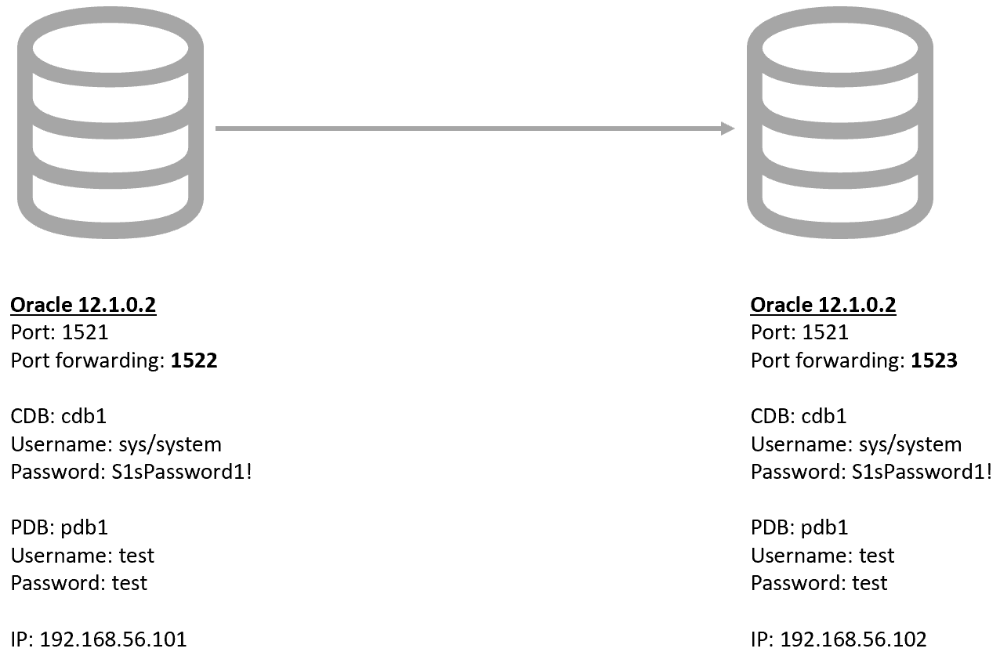

# Vagrant Shareplex to Oracle 12R1 Build

The Vagrant scripts here will allow you to build an Oracle Database 12cR1 and a Shareplex 9.2.0 by just starting the VMs in the correct order.

If you need a more detailed description of this build, check out the article here.


## Required Software

Download and install the following software.

* [VirtualBox](https://www.virtualbox.org/wiki/Downloads)
* [Vagrant](https://www.vagrantup.com/downloads.html)
* Git client (not mandatory). You can download manually and unzip the file.
* [Oracle 12R1](https://www.oracle.com/technetwork/database/enterprise-edition/downloads/database12c-linux-download-2240591.html)
* [Shareplex 9.2.0](https://support.quest.com/en-US/Login?kc_locale=en-US&dest=%2fshareplex%2f9.2.1%2fdownload-new-releases%3fstarted%3d6093403)


## Clone Repository

Pick an area on your file system to act as the base for this git repository and issue the following command. If you are working on Windows remember to check your Git settings for line terminators. If the bash scripts are converted to Windows terminators you will have problems.

```
git clone https://github.com/SergioRomera/shareplex_poc.git
```

Copy the software under the "shareplex/software" directory. From the "shareplex" subdirectory, the structure should look like this.

```
tree
.
│   README.md
│
├───config
│       install.env
│       vagrant.yml
│
├───node1
│   │   Vagrantfile
│   └───scripts
│           oracle_create_database.sh
│           oracle_user_environment_setup.sh
│           root_setup.sh
│           setup.sh
│
├───node2
│   │   Vagrantfile
│   └───scripts
│           oracle_create_database.sh
│           oracle_user_environment_setup.sh
│           root_setup.sh
│           setup.sh
│
├───node3_postgreSQL
│   │   Vagrantfile
│   └───scripts
│           postgres_user_environment_setup.sh
│           root_setup.sh
│           setup.sh
│           shareplex_postgres_install.sql
│
├───shared_scripts
│       configure_chrony.sh
│       configure_hostname.sh
│       configure_hostname_postgres.sh
│       configure_hosts_base.sh
│       configure_shared_disks.sh
│       install_os_packages.sh
│       oracle_auto_startdb.sh
│       oracle_db_software_installation.sh
│       prepare_u01_disk.sh
│       shareplex_create_test_table.sh
│       shareplex_functions.sh
│       shareplex_install.sh
│       shareplex_install_postgres_config.sh
│       shareplex_install_windows.sql
│       tables_samples.sql
│
└───software
        linuxamd64_12102_database_1of2.zip
        linuxamd64_12102_database_2of2.zip
        put_software_here.txt
        SharePlex-9.2.0-b42-oracle120-rh-40-amd64-m64.tpm
        shareplex_customer_name.txt
        shareplex_licence_key.txt


```

## Build the Shareplex System

The following commands will leave you with a functioning Shareplex installation.

Modify this files with the correct licence information:

```
/vagrant_software/
├── shareplex_customer_name.txt
├── shareplex_licence_key.txt
```

Start the first node and wait for it to complete. This will create the primary database.

```
#Primary Oracle DB
cd node1
vagrant up
```

Start the second node and wait for it to complete. This will create the second database.

```
#Secondary Oracle DB
cd ../node2
vagrant up
```

## Turn Off System

Perform the following to turn off the system cleanly.

```
cd ../node2
vagrant halt

cd ../node1
vagrant halt
```

## Remove Whole System

The following commands will destroy all VMs and the associated files, so you can run the process again.

```
cd ../node2
vagrant destroy -f

cd ../node1
vagrant destroy -f
```

##Shareplex configuration

